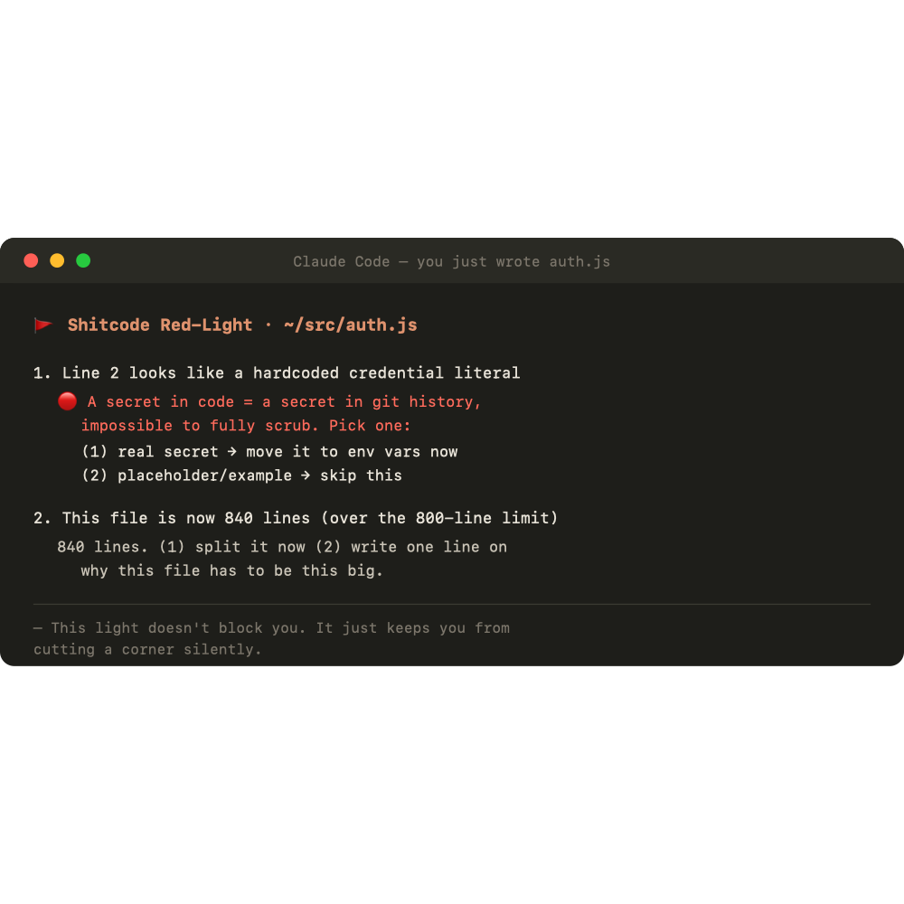
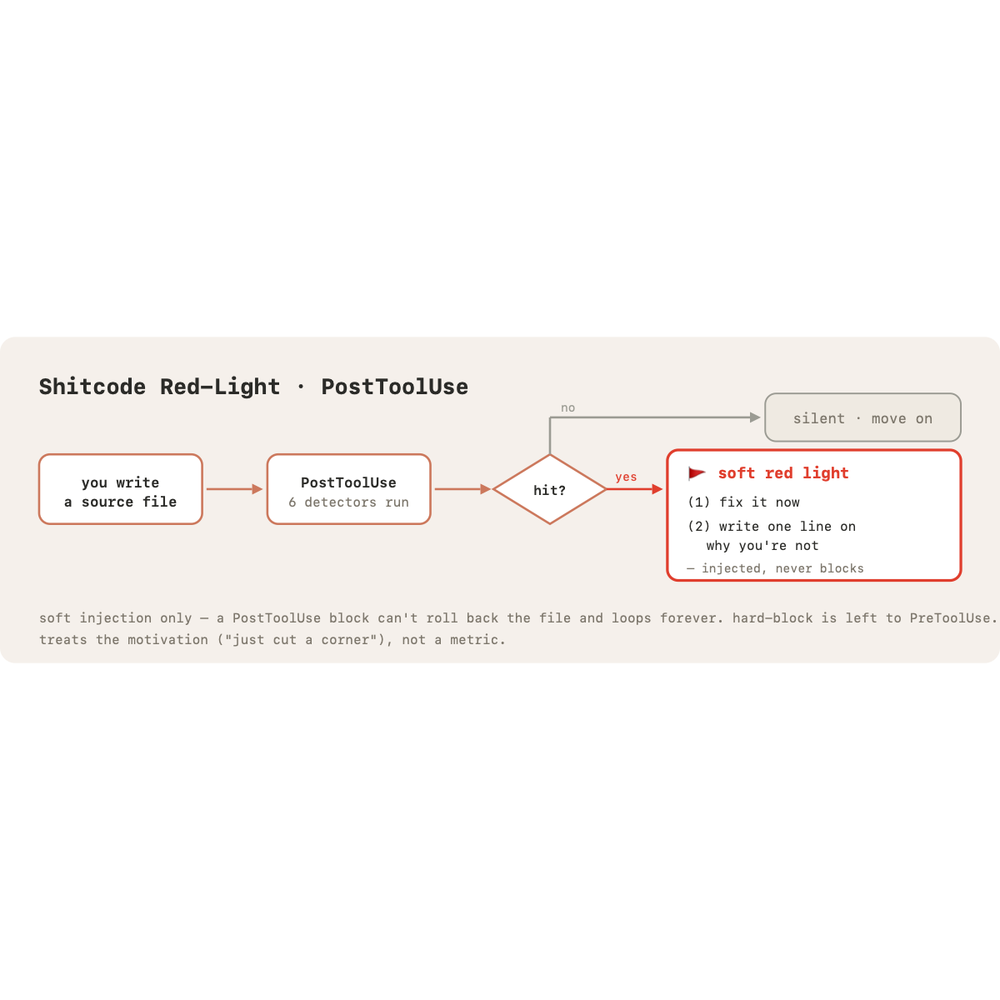

<div align="center">


# Claude Brain · Shitcode Red-Light

**A PostToolUse hook for Claude Code that catches shitcode the moment you write it —
and forces a conscious choice instead of letting it slide.**

`zero deps` · `language-agnostic` · `soft-inject, never blocks` · `~400 lines`

</div>

> [!NOTE]
> Unofficial, community project. **Not affiliated with or endorsed by Anthropic.**
> "Claude" is a trademark of Anthropic, PBC.

---

## The problem

LLMs — and humans — write shitcode for the same reason: **the code runs *now*, so the
reward is immediate. The cost of bad structure is in the future, where it's invisible.**

"Just make it work" is an instant payoff. Clean architecture pays off later, to someone
else, maybe never to you. So the model defaults to the corner-cut: a 600-line function,
a key pasted into source, a `console.log` left behind, five TODOs that never come back.

A linter doesn't fix this — it gives you an error list you scroll past. The *motivation*
to cut the corner is untouched.

**Shitcode Red-Light translates the delayed cost into an immediate signal — right at the
second you write the code — and forces a binary choice:**

<div align="center">

</div>

> **(1) fix it now**, or **(2) write one line on _why you're not_.**

It treats the *motivation*, not a metric. Hand-waving costs more than just doing it.

---

## What it catches

Six pure, dependency-free, language-agnostic detectors:

| Detector | Fires when |
|:---|:---|
| 🔴 `hardcoded_secret` | `sk-`/`AKIA`/PEM/`gh_` tokens, or `key=...` literals with real entropy |
| `file_too_long` | yellow > 500 lines · red > 800 |
| `long_function` | one contiguous code block > 80 real-code lines |
| `dead_code` | commented-out code blocks ≥ 6 lines (JSDoc-exempt) |
| `todo_pileup` | ≥ 5 TODO/FIXME/HACK/XXX in one file |
| `debug_leftover` | ≥ 2 `console.log`/`debugger` in a non-test file |

Every threshold lives in `config.json` — tune one place, no code changes.

## How it works

<div align="center">

</div>

**Why PostToolUse?** A pre-prompt reminder is *too early* (you haven't touched code yet);
a session-end audit is *too late* (the shitcode already exists). PostToolUse fires at the
exact second a file is written — the moment shitcode is actually born.

**Why soft-inject, never block?** A PostToolUse `decision:block` does **not** roll back
the written file, and the rejection drives a retry of the same write → file unchanged →
block again → **infinite loop until tokens run out.** So every finding is a soft injection
(even secrets — surfaced loudly with 🔴, but never blocking). Hard-blocking is reserved
for a future PreToolUse hook. See [docs/DESIGN.md](docs/DESIGN.md) for the full rationale.

---

## Install

Requires Node.js (18+) and Claude Code.

```bash
git clone https://github.com/384961890-ui/claude-brain.git ~/.claude-brain
cd ~/.claude-brain
node install.js          # backs up settings.json, appends the hook (idempotent)
```

Then turn it on:

```bash
# edit ~/.claude-brain/config.json → set "enabled": true
```

Open a **new** Claude Code session (hooks load at session start). Done.

To remove: `node install.js --uninstall`

## Configure

`config.json` (seeded from `config.example.json`). Key knobs:

```jsonc
{
  "enabled": true,
  "file_too_long": { "hard_max": 800, "warn": 500 },
  "throttle_minutes": 15,        // at most one light per file per N minutes
  "max_findings_shown": 2,       // anti-flood: show only the heaviest findings
  "skip_path_patterns": [        // add your private paths so it never reads them
    "node_modules", "/dist/", ".claude-brain"
  ]
}
```

## Test

```bash
node scripts/selftest.js     # 7/7 PASS
```

---

## 中文说明

**这是什么** — 一个 Claude Code 的 PostToolUse 钩子。大模型爱写"屎山代码"——不是不会写好，是**没动机写好**：好代码的回报在未来，它看不见；"能跑就行"是眼前的即时奖励。这个钩子把"未来的维护代价"翻译成**写完那一秒的即时红灯**，逼你做二选一：**① 现在改 ② 写一句为什么不改**。治的是"图省事"这个动机，不是凑指标。

**为什么挂 PostToolUse** — 动手前提醒太早（还没碰代码），收尾审查太晚（屎山已成型），写完那一秒正好补中间。

**为什么只软提醒不硬拦** — PostToolUse 的 `decision:block` 不回滚已写入的文件，还会触发"拦→重试→再拦"的死循环。所以连密钥都软注入（🔴 醒目但不阻断），真硬拦留给未来的 PreToolUse。

**六个检测器** — 硬编码密钥 / 文件过长 / 单函数过长 / 死代码 / TODO 堆积 / 调试残留。全部纯函数、零依赖、语言无关，阈值都在 `config.json` 里。

**安装** — `git clone` 到 `~/.claude-brain` → `node install.js` → 把 config.json 的 `enabled` 改 `true` → 开个新会话。

---

<div align="center">

MIT License · contributions welcome

</div>
