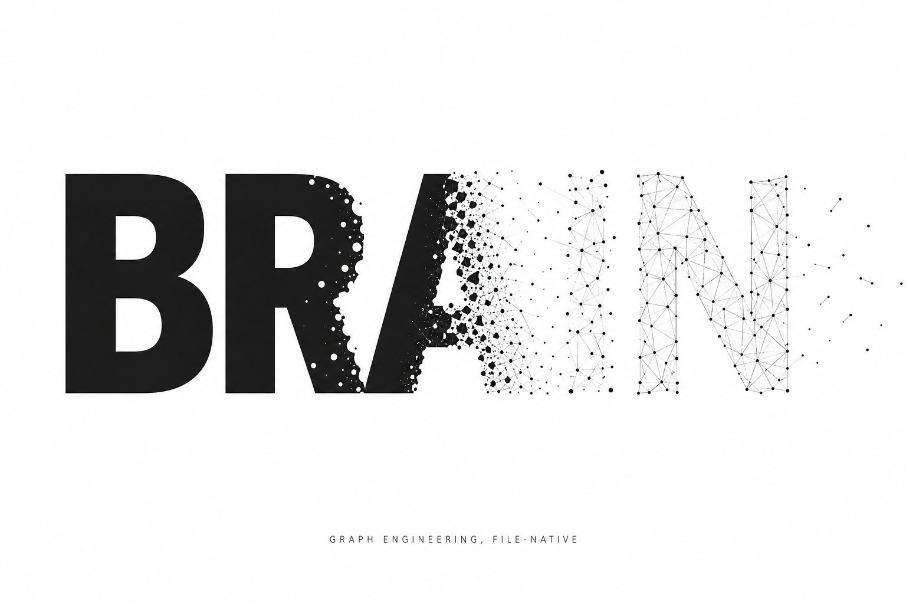

# Brain

> **Memory is the product. Everything else is scaffolding.**
>
> 记忆才是产品。其余一切都是脚手架。

*Every morning you wake to a notebook on the pillow — only by reading it
do you know who you are.*

*The sticky note on the fridge is your only evidence of whether the
vegetables have gone bad.*

*The name tag hanging around your neck is the one thing that keeps you
from getting lost.*

*每天起床 枕边有一本笔记 翻阅它 你才知道自己是谁*

*冰箱上的便利贴 是你判断蔬菜是否腐烂的唯一证据*

*出门前脖子上挂的胸牌 保证了你不会走丢*

## An agent is, by nature, an Alzheimer's patient. Brain is the cure. · Agent 本质上是一个阿兹海默患者 而 Brain 是解药

Every session, you re-explain the project. Every session, it repeats the
mistake you corrected last Tuesday. You have become a context-loading
machine for a tool that forgets you the moment the window closes.
The most expensive engineer on your team is you, re-teaching an intern
who resets to day one every morning.

每个 session 你都在重新解释项目背景。每个 session 它都在重犯你上周二刚纠正过的错。
你已经变成了一台人肉上下文加载机 伺候一个窗口一关就把你忘光的工具。
你团队里最贵的工程师是你自己——每天早上重新培训一个永远停留在入职第一天的实习生。

**If your agent starts from zero every session, when does it ever become
an expert?**

**如果你的 agent 每次 session 都从零开始 它什么时候才能真正成为专家？**

Brain exists to end that. Some tools make your AI faster today; Brain
makes it better over time. This is not a project that wows you five
minutes after install — it is the one that, three months in, makes you
ask: *how did I ever work without this?*

Brain 就是来终结这件事的。有些工具让 AI 今天更快 Brain 让 AI 随着时间变得更好。
它不是装完五分钟就惊艳的项目 而是三个月后让你回头想
"以前没有它 我到底是怎么工作的？"的那种项目。

### What actually changes · 用了到底会怎样

| | Without Brain | With Brain |
|:--|:--|:--|
| **Session 1** | A stranger. You explain everything. | A stranger. You explain everything. (Yes — no day-one magic. Read on.) |
| **Session 10** | Still a stranger. | Knows your projects, your landmines, the decisions you already made. |
| **Session 100** | Still a stranger. | A veteran who knows *why* the last change was made and what this one connects to. |
| **Its mistakes** | Repeated forever. | Captured as lessons, injected back, and *audited* — v8 attributes real session outcomes to each lesson, so dead advice decays out. |
| **Your data** | Buried in chat logs you'll never open. | A graph you can `cat`, `grep`, and `git diff`. Yours. |

| | 没有 Brain | 有 Brain |
|:--|:--|:--|
| **第 1 次 session** | 陌生人 一切从头解释 | 陌生人 一切从头解释（对 第一天没有魔法 往下看） |
| **第 10 次 session** | 还是陌生人 | 记得你的项目、你的雷区、你已经拍过的板 |
| **第 100 次 session** | 还是陌生人 | 一个知道上次为什么改、这次连着什么的老兵 |
| **它犯的错** | 永远重犯 | 被抓成教训 注入回去 还被**审计**——v8 把真实 session 表现归因到每条教训 没用的建议自动衰减出局 |
| **你的数据** | 埋在你永远不会翻的聊天记录里 | 一张 `cat` 得到、`grep` 得到、`git diff` 得到的图谱 完全属于你 |

The value of Brain is not that session 1 gets better.
It is that **session 100 is stronger than session 1** — and keeps going.

Brain 的价值不在于让第 1 次 session 更好
而在于**让第 100 次 session 比第 1 次更强** 并且一直强下去。

---

This is the final, complete, open release of Brain. Everything is here.
There will be no further open-source releases — not because we are done
building, but because what comes next is built *on top of* what you are
looking at. This repository is the foundation, released whole.

这是 Brain 的最终完整开源版。全部都在这里。此后不再有开源更新
不是因为我们停止了构建 而是因为接下来的东西建立在你眼前这些之上。这个仓库是地基 完整交付。

---

## The argument · 立论

The industry spent 2025 arguing about context engineering. It is spending
2026 converging on a harder truth: **an agent is worth exactly as much as
the structure of what it remembers.**

Model capabilities decay into commodities. A feature the next generation
of models will replace is a failed design — one that depreciates from the
day it ships. What does not depreciate is accumulated, structured,
*auditable* experience and memory: who said what, what changed, why it
changed, and what it connects to.

This is what **Graph** means. A graph — like an atlas, like a fishing net,
like a galaxy, like a brain: countless points and lines, woven together.

We chose the lightest, plainest way to build one — so that a long-running
agent never loses itself between sessions. Every mechanism in this
repository is a scar from making that true.

Our position is unambiguous: **you do not need a graph database.** Plain
text gives you the core trio of graph engineering — edges, time, multi-hop —
while keeping grep, diff, and git ownership. A graph you cannot `cat` is
a graph you do not own.

模型能力会贬值成日用品 如果一个功能会被下一代模型的能力替代 那么便是一个失败的、持续贬值的设计 不贬值的是积累下来的、结构化的、可审计的经验与记忆。
这个叫做——Graph 像一张图谱 像一张渔网 像星系 像大脑 由无数个点与线 组成了这个东西
我们用最轻量 最淳朴的方式 让一个长期运行的 agent 不会在会话之间丢失自己 这个仓库里的每个机制都是修这件事留下的疤
我们的立场很明确：**你不需要图数据库**——纯文本给你图工程的核心三件套
还保住了 grep、diff 和 git 所有权。一张你没法 `cat` 的图 不是你的图。

## What ships · 交付内容

**Version: 8.3 — the final release.**

| Package | What it is |
|:---|:---|
| **`memory-spec/`** | The structured-memory standard: three-layer index tree, dual-section records (current conclusion + append-only history = a file-native temporal knowledge graph), six memory types, wikilink graph layer, write-time gate, nightly gardener. Templates and four runnable scripts. |
| **`qmd-engine/`** | Local semantic retrieval: embedding recall + reranker, resident daemon, atomic index rebuild, health checks. Off-the-shelf open models (Qwen3-Embedding-4B, Qwen3-Reranker-0.6B) — we trained nothing; we engineered everything around them. `PITFALLS.md` documents the incidents that paid for that engineering. |
| **Core loops** (`v2/`–`v6/`) | Hook-based orthogonal loops that discipline LLM instincts. Each loop targets one instinct; none replaces another. See the evolution table below. |
| **Pipeline** (`scripts/`) | Injection + lesson-lifecycle machinery: intent-routed tiered retrieval (grep floor → embedding → reranker), **graph-aware recall** (one-hop `[[wikilink]]` expansion, hard-capped), correction-signal capture, decay with **efficacy attribution** (v8) that closes the loop between "which lesson got injected" and "how did that session actually go." |

## Evolution · 演进史

Brain was not designed in one shot. Each version answers a specific failure mode observed in production, and every previous layer is still shipped and still running — none is deprecated by a later one. The full history is in this repository; the table is a map.

Brain 不是一次设计出来的。每一版都在治一个真实观察到的失败模式 而且**没有任何一层被后续版本替代 全部还在跑**。仓库里能翻到所有历史 下面这张表是地图。

| Version | Instinct it disciplines · 治什么本能 | Where to look |
|:---|:---|:---|
| **v2 · honest-loop** | Self-deception — the model claims work is done when it isn't. Stop-hook captures correction signals from the human and turns them into draft lessons. | `v2/`, `scripts/capture-lesson.js` |
| **v3 · think-loop** | Single-direction grinding — pushing harder at a stuck point instead of stepping back. Injects a breakout checklist when a stuck-flag is raised. | `v3/`, `scripts/inject-context.js` |
| **v4 · idea-loop** | Sunk-cost persistence at the strategic layer — the CEO-agent forgetting to zoom out. Triggers on project-iteration contexts. | `v4/` |
| **v5 · multimodal ingest** | Input surface too narrow — images, screenshots, PDFs never become recallable memory. Extends what can enter the memory tree. | `v5/` |
| **v6 · slop red-light** | The lazy-shortcut instinct: writing shitcode because it's easier. PostToolUse hook lights an immediate red flag the moment it happens, forcing the choice: fix it, or write one line saying why not. | `v6/` |
| **v7 · lesson lifecycle** | Old lessons accumulating into noise. Adds decay, archival, and rejection so the lesson set stays sharp instead of monotonically growing. | `scripts/decay-lessons.js`, `scripts/archive-rejected.js` |
| **v8 · efficacy attribution** | *"Which of these lessons is actually working?"* A per-session behavior score gets attributed back to the lessons that were injected in that session — the first mechanism here that closes the loop between injection and outcome, not just injection and time. | `scripts/efficacy.js`, `scripts/track-behavior.js`, `scripts/analyze-behavior.js` |
| **v8.1 · unified sanitized release** | The first attempt at a public, personally-scrubbed release of v2–v8. Later found to be incomplete — see v8.3. | git history from June 2026 |
| **v8.2 → v8.3 · Graph engineering, released whole** | The gap that v8.1 left behind: the structured-memory standard we assumed "everyone would figure out," the local retrieval engine we assumed was too specific to share, and one-hop graph-aware recall. `memory-spec/` + `qmd-engine/` + `scripts/link-expand.js`. **Released whole; this is the final open release.** | This commit |

## What this is not · 这不是什么

- Not a graph database, and not pretending to be one.
- Not a framework — it is a set of conventions plus small scripts that
  attach to any agent harness with hook points.
- Not a benchmark chase. Every design decision here traces to a production
  incident, and `LESSONS-LEARNED.md` names the incident.

## Design creed · 设计信条

1. **Files over databases.** Auditability is a feature you cannot retrofit.
2. **History is append-only.** A conclusion that overwrites its past is a
   conclusion you cannot trust. Time is a first-class dimension, not a log.
3. **Failures must be loud.** A retrieval layer that silently returns empty
   is worse than no retrieval layer. We learned this the hard way; it is
   now enforced by tooling, not discipline.
4. **The cheapest tier first.** grep before embeddings, embeddings before
   rerankers. Intelligence is for when structure runs out.
5. **Structure appreciates, capability depreciates.** Build the former,
   rent the latter.

## Quick start

See `memory-spec/README.md` to bootstrap a memory tree in five minutes,
and `qmd-engine/DEPLOY.md` to stand up local semantic retrieval beside it.
Neither requires the other — the spec works with grep alone.

## License

MIT. Take it, build on it, prove us wrong somewhere — that is what a
foundation is for.

---

*Released whole, once. 完整交付 仅此一次。*
